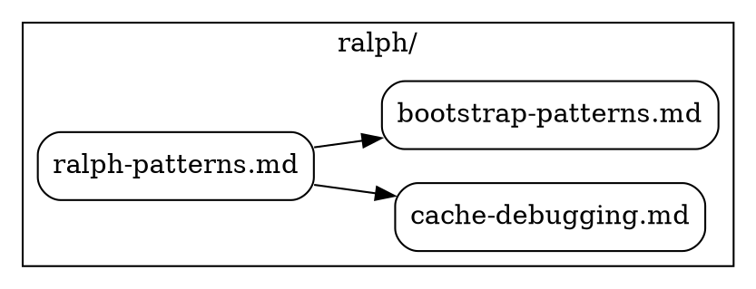

# Skill Graph Generator

## Purpose

Generate a visual dependency graph of skills in the brain repository. Analyzes markdown files in `skills/` to extract cross-references and outputs a DOT graph showing relationships between skill documents.

## Usage

### Basic Usage

```bash
# Output DOT to stdout
bash tools/skill_graph/skill_graph.sh

# Save to file
bash tools/skill_graph/skill_graph.sh --output skills.dot
```

### Rendering the Graph

#### Option 1: Graphviz (Local)

```bash
# Generate PNG
bash tools/skill_graph/skill_graph.sh | dot -Tpng > skills.png

# Generate SVG (interactive, scalable)
bash tools/skill_graph/skill_graph.sh | dot -Tsvg > skills.svg

# Generate PDF
bash tools/skill_graph/skill_graph.sh | dot -Tpdf > skills.pdf
```

**Install Graphviz:**

```bash
# Ubuntu/Debian
sudo apt-get install graphviz

# macOS
brew install graphviz

# Windows (WSL)
sudo apt-get install graphviz
```

#### Option 2: Online Tools (No Installation)

1. Generate DOT file: `bash tools/skill_graph/skill_graph.sh > skills.dot`
2. Visit one of these online renderers:
   - <https://viz-js.com/> (recommended)
   - <https://dreampuf.github.io/GraphvizOnline/>
   - <https://edotor.net/>
3. Paste the contents of `skills.dot` and view the rendered graph

## Output Format

The tool generates a **directed graph** in DOT format with:

- **Nodes:** Each skill document (e.g., `ralph-patterns.md`, `bootstrap-patterns.md`)
- **Edges:** Links between documents (e.g., `ralph-patterns.md` → `cache-debugging.md`)
- **Clusters:** Skills grouped by domain (e.g., `ralph/`, `code-quality/`, `languages/shell/`)

### Example Output



## Components

### 1. `extract_links.py`

Scans `skills/` directory for markdown files and extracts cross-references.

**Output:** JSON array of `{source, target, type}` objects

**Example:**

```json
[
  {"source": "ralph/ralph-patterns.md", "target": "code-quality/code-hygiene.md", "type": "reference"},
  {"source": "languages/shell/strict-mode.md", "target": "languages/shell/validation-patterns.md", "type": "reference"}
]
```

### 2. `generate_graph.py`

Reads JSON from stdin and generates DOT graph with clustering by domain.

**Output:** Valid DOT syntax

### 3. `skill_graph.sh`

Wrapper script that pipes `extract_links.py` → `generate_graph.py`.

**Options:**

- `--output FILE.dot` - Write to file instead of stdout
- `--help` - Show usage information

## Use Cases

### 1. Discover Related Skills

Visualize which skills are frequently referenced together:

```bash
bash tools/skill_graph/skill_graph.sh | dot -Tsvg > skills.svg
# Open skills.svg in browser to explore connections
```

### 2. Find Orphaned Skills

Skills with no incoming edges may need better integration:

```bash
bash tools/skill_graph/skill_graph.sh | grep -v " -> " | grep "\.md"
```

### 3. Identify Hub Skills

Skills with many outgoing edges are foundational:

```bash
bash tools/skill_graph/skill_graph.sh | grep " -> " | cut -d' ' -f1 | sort | uniq -c | sort -rn | head -10
```

### 4. Validate Documentation Links

Check if referenced skills actually exist:

```bash
python3 tools/skill_graph/extract_links.py | jq -r '.[] | .target' | while read -r target; do
  [[ -f "skills/$target" ]] || echo "Missing: $target"
done
```

## Troubleshooting

### "command not found: dot"

Install Graphviz (see [Rendering the Graph](#option-1-graphviz-local) above).

### Empty or Minimal Graph

- **Check skill files exist:** `ls -la skills/domains/`
- **Check for markdown links:** `rg "\[.*\]\(.*\.md\)" skills/domains/ | head -20`
- **Run extract manually:** `python3 tools/skill_graph/extract_links.py | jq`

### Graph Too Large to Render

Use filtering or focus on a specific domain:

```bash
# Filter to only ralph skills
python3 tools/skill_graph/extract_links.py | jq '[.[] | select(.source | startswith("ralph/"))]' | python3 tools/skill_graph/generate_graph.py | dot -Tpng > ralph_skills.png
```

## See Also

- **[skills/index.md](../../skills/index.md)** - Complete skills catalog
- **[skills/SUMMARY.md](../../skills/SUMMARY.md)** - Skills overview
- **[skills/self-improvement/skills/self-improvement/GAP_BACKLOG.md](../../skills/self-improvement/GAP_BACKLOG.md)** - Skill gaps
